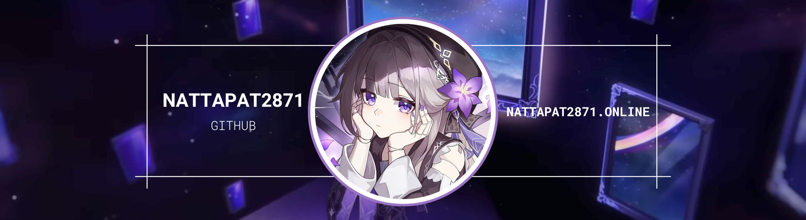

HELLO WORLD,  My name is Nattapat Jitsom
====================================================================================================================================

Junior student developer
------------------------

I've been really into computers ever since I was young. I went from being a kid hooked on games to wanting to actually develop things – like apps, games, and more.

* 🌍  I'm based in Chiang Mai, Thailand
* 🧠  I'm learning a new next.js and C++
* ⚡  kuru kuru kururin
* 📲  contact me here [discord](https://discord.gg/RbyUEseDYP)

## Socials

## Skills

## My GitHub Stats

<a href="https://github.com/nattapat2871" align="left">
  <picture>
    <source
      media="(prefers-color-scheme: dark)"
      srcset="https://github-readme-stats.vercel.app/api/top-langs/?username=nattapat2871&langs_count=10&locale=en&custom_title=Top%20Languages&theme=github_dark"
    />
    <source
      media="(prefers-color-scheme: light)"
      srcset="https://github-readme-stats.vercel.app/api/top-langs/?username=nattapat2871&langs_count=10&locale=en&custom_title=Top%20Languages&theme=default"
    />
    
  </picture>
</a>
&nbsp &nbsp &nbsp
<a href="http://www.github.com/nattapat2871">
  <picture>
    <source
      media="(prefers-color-scheme: dark)"
      srcset="https://github-readme-stats.vercel.app/api?username=nattapat2871&show_icons=true&hide=&count_private=true&theme=github_dark"
    />
    <source
      media="(prefers-color-scheme: light)"
      srcset="https://github-readme-stats.vercel.app/api?username=nattapat2871&show_icons=true&hide=&count_private=true&theme=default"
    />
    
  </picture>
</a>

### Support Me

<ul style="list-style-type: none; margin: 0;">

<li style="display: inline-block; margin-right: 0.25rem;"></li>
<a href="https://tipme.in.th/nattapat2871">Tipme</a>

</ul>

<picture>
  <source media="(prefers-color-scheme: dark)" srcset="https://raw.githubusercontent.com/Nattapat2871/Nattapat2871/output/github-snake-dark.svg" />
  <source media="(prefers-color-scheme: light)" srcset="https://raw.githubusercontent.com/Nattapat2871/Nattapat2871/output/github-snake.svg" />
  
</picture>
